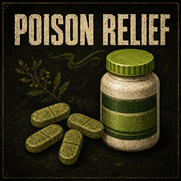

# Gastro-Calm & Herbal Tablets



A Project Zomboid Build 42 mod that adds two treatments for Food Sickness:
factory-made **Gastro-Calm Tablets** and craftable **Crude Herbal Tablets**.

Both medicines provide limited immediate relief and continue working over time.
They can give a poisoned survivor a fighting chance without making dangerous
food completely harmless.

## Features

- Factory-made Gastro-Calm blister packs found in medical loot.
- A craftable herbal alternative made from lemongrass.
- Immediate relief followed by progressive treatment.
- Ten doses per Gastro-Calm blister pack.
- Reduces both Food Sickness and Poison by the same amount.
- Progressive relief can stack up to a 70-point treatment-bank cap.
- Can be taken from carried bags, accessible loot containers, and the floor.
- Single-player and multiplayer support.
- Server-authoritative medicine use in multiplayer.
- No dependencies.

## Treatments

| Treatment | How to obtain | Effect per dose |
| --- | --- | --- |
| **Gastro-Calm Tablets** | Medical loot | 10 immediate relief, then 25 over 45 in-game minutes (35 total) |
| **Crude Herbal Tablet** | Crafting | 7 immediate relief, then 15 over one in-game hour (22 total) |

Taking another dose can add more relief, but it does not make the active
treatment run faster. When different medicines are active, the fastest one
determines the recovery rate.

> [!IMPORTANT]
> Each relief point reduces both Food Sickness and Poison, independently
> clamped at zero. These tablets do not cure zombie infection, wound
> infection, colds, or directly restore ordinary health. Because treatment is
> partly gradual, taking a tablet too late may not save the character.

## Finding Gastro-Calm

Gastro-Calm blister packs may appear in:

- Medical-clinic drug storage.
- Medical storage.
- Bathroom counters, rarely.

Each fresh blister contains ten doses and uses the same remaining-uses mechanic
as vanilla drainable medicines. Loot changes only affect containers whose
contents have not already been generated.

## Crafting the herbal alternative

Use a mortar and pestle with **two units of lemongrass** to make **four Crude
Herbal Tablets**. The mortar and pestle is kept and may take light wear.

Crude Herbal Tablets do not spawn as loot, and Gastro-Calm cannot be crafted.

## Using the tablets

Select the medicine in the character's inventory, a carried bag, an accessible
loot container, or the floor inventory. Right-click it and choose **Take
Stomach Relief Tablet**.

The game temporarily transfers externally stored medicine using the same flow
as vanilla painkillers. A Gastro-Calm blister returns to its original container
with one fewer dose, while a Crude Herbal Tablet is consumed completely.

Treatment progress is stored with the character and continues after saving and
loading. In multiplayer, the server validates and consumes each dose before
applying the treatment.

## Compatibility

- **Game version:** Project Zomboid Build 42
- **Single-player:** Supported
- **Multiplayer:** Supported
- **Dependencies:** None
- **Mod ID:** `PoisonRelief`
- **Workshop ID:** 3780712089

Servers and connecting players must all enable the mod.

## Installation

### Steam Workshop

The Workshop release is coming soon. Once published, subscribe to the item,
enable **Gastro-Calm & Herbal Tablets** in the Mods menu, and restart the game.

### Manual installation

Copy the following directory from this repository:

```text
Contents/mods/PoisonRelief
```

Place it at:

```text
C:\Users\YOUR_NAME\Zomboid\mods\PoisonRelief
```

Enable **Gastro-Calm & Herbal Tablets** in the Mods menu and restart the game.

## Feedback and bug reports

Found something strange, survived something you definitely should not have, or
watched a tablet disappear without helping? Open an issue in the
[GitHub issue tracker](https://github.com/dromilano/PoisonRelief/issues) with
the game version, single-player or multiplayer status, and any relevant errors
from `console.txt`.

## Credits

Created by **Dro**.

Preview images created with AI
